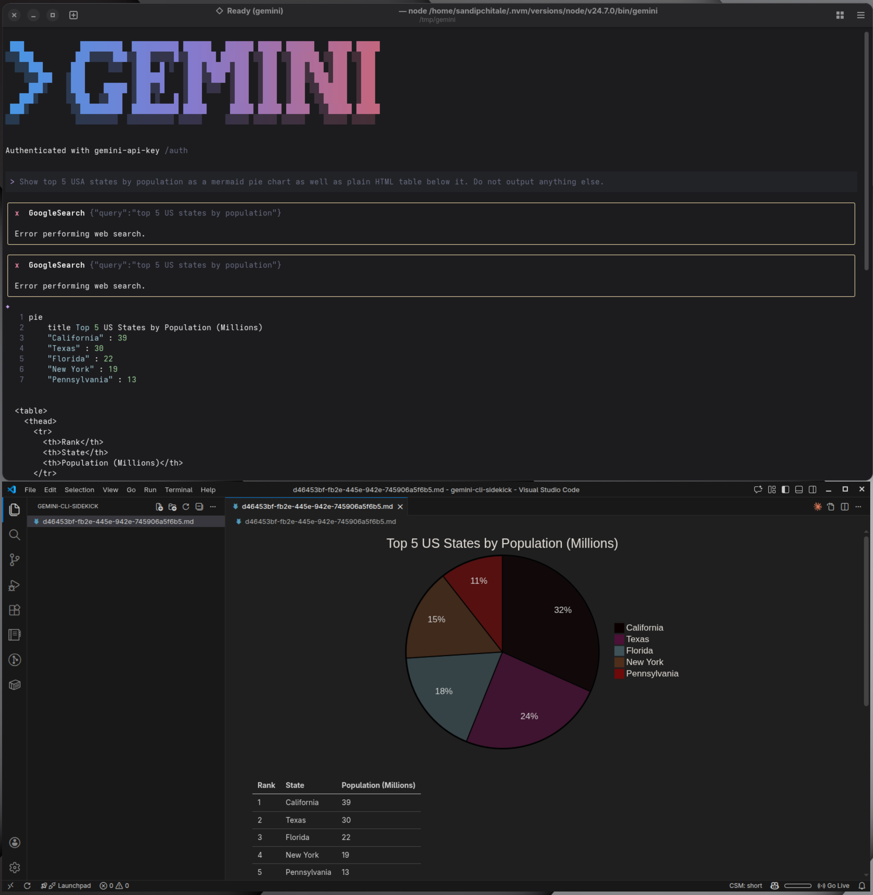

# Sidekick Gemini CLI extension / Claude Code Plugin

This implements hooks for Gemini CLI and CLaude Code to provide the following hooks.

## Key Idea

`gemini` cli or `claude` code are terminal based chat interface. This means it is incapable of rendering rich output like HTML tables, Mermaid charts etc. This extension provides a way to render rich output in VSCode.

## Lifecycle Hooks

- `SessionStart`: Called when a new session is started. It ensures that there is /tmp/gemini-cli-sidekick folder. Create a session specific markdown file and launches VSCode (code executable needs to be on your PATH variable).
- `BeforeModel/UserPromptSubmit`: Called before a model is invoked. This basically adds the prompt to the session specific file in markdown format.
- `AfterModel/Stop`: Called after a model responds (chucks). This appends the model response to the per session file. `AfterModel` hoot for `gemini cli` is streaming. `Stop` hook for `claude code` is one shot.
  - With each volley with the model, the above two hooks are called over and over. If there is any rich output in the model response, it is rendered in VSCode and markdown support takes care of the rest. Thus the VSCode acts as a sidekick to the Gemini CLI like Robin to Batman.
- `SessionEnd`: Called when a the session ends. This deletes the per session file.

### Screenshots

#### `gemin cli`

### Prerequisites

- Node.js 23.6+
- npm
- VSCode
  - `code` command in your path
  - (optional) Mermaid extension for Mermaid charts

## Installation

### Steps

- [Gemini Cli Extension README](claude-code-plugin/README.md)
- [Claude Code Plugin README](gemini-cli-extension/README.md)

